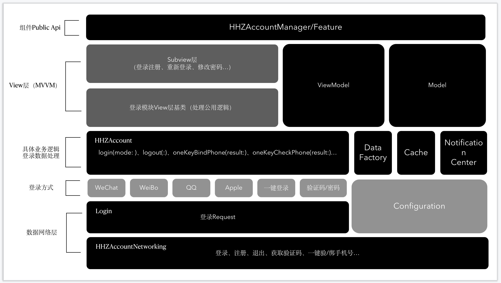

# 登录注册模块
### 登录注册模块的整体结构



以上是重构后的用户登录注册模块，在重构之前原登录注册代码结构是通过一个`LoginManager`管理具体的ViewController，看似统一管理，但其实ViewController又各施其政；且很多重复的代码，例如重构后的`DataFactory`中的一些具体逻辑代码就遍布各ViewController，这增加了后期维护成本，且牵一发而动全身。重构后，自上而下的依次去掉每一层后都可以拿出来单独使用，重构后代码逻辑清晰，维护成本低且不与项目中的其他业务代码耦合。

### 一、数据网络层

最低层HHZAccountNetworking是对自己服务端提供的API封装的工具类，为上层提供具体方法：

```
class HHZAccountNetworking {
    
    ///注册
    	
    /// 登录
    class func login(param: LoginParam, result: @escaping NetResult) {
        request(url: api("Login"), param: param.toJSON(), result: result)
    }
}
	///密码登录
	
	///验证码登录
	
	///获取验证码
	
	///一键登录
	
	///等等...
	
	///重置密码
	class func resetPassword(param: ResetPasswordParam, result: @escaping NetResult) {
        request(url: api("resetPassword"), param: param.toJSON(), result: result)
    }
```

```
extension HHZAccountNetworking {
    
    class func api(_ patch: String) -> String {
        return 拼接成具体的server api
    }
    
    class func request(url: String, param: [String: Any]?, result: @escaping NetResult) {
        ///依赖网络库，创建request对象，发起网络请求...
}

```
### 二、登录方式

`Login`是基于`HHZAccountNetworking`创建的登录基类，他实现了一个`func requestLogin()`方法，

```
func requestLogin(param: LoginParam) {
	HHZAccountNetworking.login(param: param) {...}
}

```

还有一个`var result: Result?`属性闭包;

`Login`的子类有:

* VerCode		验证码登录
* Password	密码登录
* SDKLogin	第三方SDK登录基类

`SDKLogin`的子类有：

* Weibo
* WeChat
* QQ
* Apple

其中`VerCode `、`Password `直接继承自`Login`，以验证码登录为例，对上层提供具体的登录方法，接收两个参数，其中result用来设置`Login`基类中的`var result`，以便将网络请求的结果回调给上层：

```
func verCodeLogin(param: VerCodeLoginParam, result: Result?) {
	self.result = result
	...
}

```

`SDKLogin`继承自`Login`同时也是第三方登录的基类，其中统一处理了解绑和绑定逻辑；

其它第三方类都继承自`SDKLogin`，子类中通过SDK提供的方法获取登录注册等接口需要的参数信息；

**无论是哪种登录方式，都是拼接登录参数，请求登录接口拿到`Response`，然后通过`result`闭包将登录结果回调给`业务逻辑层`处理数据**

#### Configurations
Configurations是一个`struct`类型，是一些具体的第三方的配置信息...

```
struct Confings {
    
    enum HttpMethod: String {
        case GET = "GET"
        case POST = "POST"
    }
    
    struct Weibo {
        static let redirectUri = ""
        static let requestURL = ""
        static let scope = ""
        static let httpMethod = HttpMethod.GET.rawValue
    }
    
    struct WeChat {
        static let scope = ""
        static let state = ""
        static let grantType = ""
        static let authURL = ""
        static let userInfoURL = ""
        
        static let appKey = ""
        static let appSecret = ""
    }
    
    ...
}
```

### 三、登录中的具体业务逻辑及数据处理层

##### 1、 HHZAccount

`HHZAccount`对外提供一个login接口，接收一个关联型枚举参数；关联枚举类型参数便于外部调用，有没有参数，需要传什么参数`一点.`便知；

```
public class HHZAccount {

	///登录模式
    enum LoginMode {
        case weiBo
        case weChat
        case qq
        case apple
        case verCode(param: VerCodeLoginParam)
        case password(param: PasswordLoginParam)
    }
    
    ///数据处理
    let dataFactory = DataFactory()
    
    /**登录方式**/
    let weiBo = Weibo()
    let weChat = WeChat()
    let qq = QQ()
    let apple = Apple()
    let verCode = VerCode()
    let password = Password()
    
    func login(mode: LoginMode) {
    switch mode {
        case .weiBo:
        		self.weiBo.login { result in
        			///...
        			self.dataFactory.processLoginResult(result)
        		}
        case .weChat:
        ...
        case .password(let param):
        		self.password.passwordLogin(param: param) { result in
        			///...
        			self.dataFactory.processLoginResult(result)
        		}
    }
}
```

##### 1、 DataFactory、Cache、AccountNotification

`DataFactory`用来处理注册/登录网络返回的Response：

* 解析Response处理注册/登录具体的逻辑；
* 使用`Cache`缓存具体的信息；
* 使用`AccountNotification`发送登录注册的具体通知；

### 四、View层

View层无需多言，就是基于以上使用MVVM搭建的具体登录注册页面；

### 五、HHZAccountManager

`HHZAccountManager`是对注册、登录模块界面具体跳转的封装，外部只需调用一个`分发`的方法调起某一个登录页面，当用户点击页面上的登录或者注册按钮后直到进入app首页前的页面跳转逻辑都有其处理，所以基本多外只提供一些服务方法，具体的实现和页面流转外部不用管；


